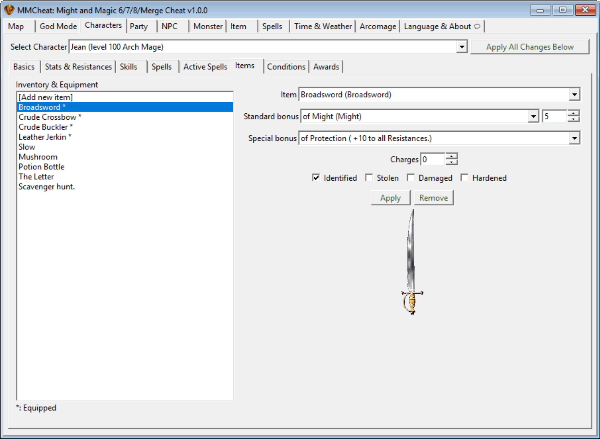
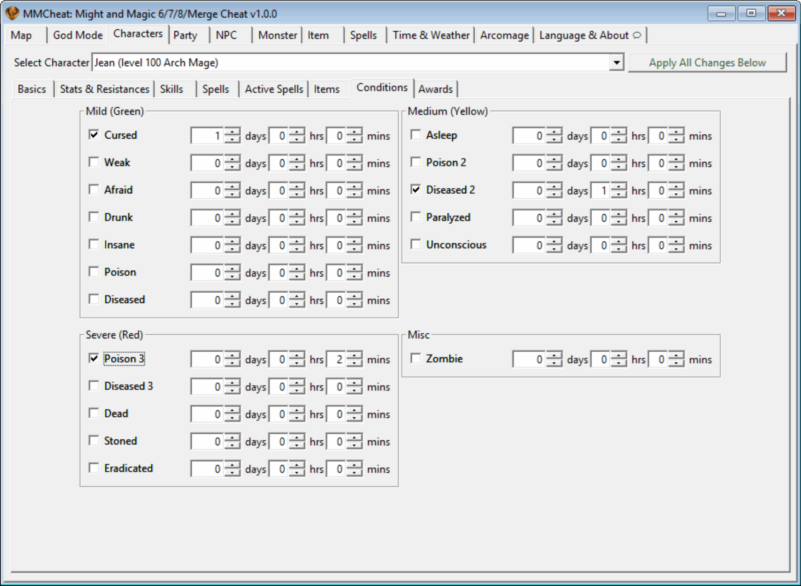
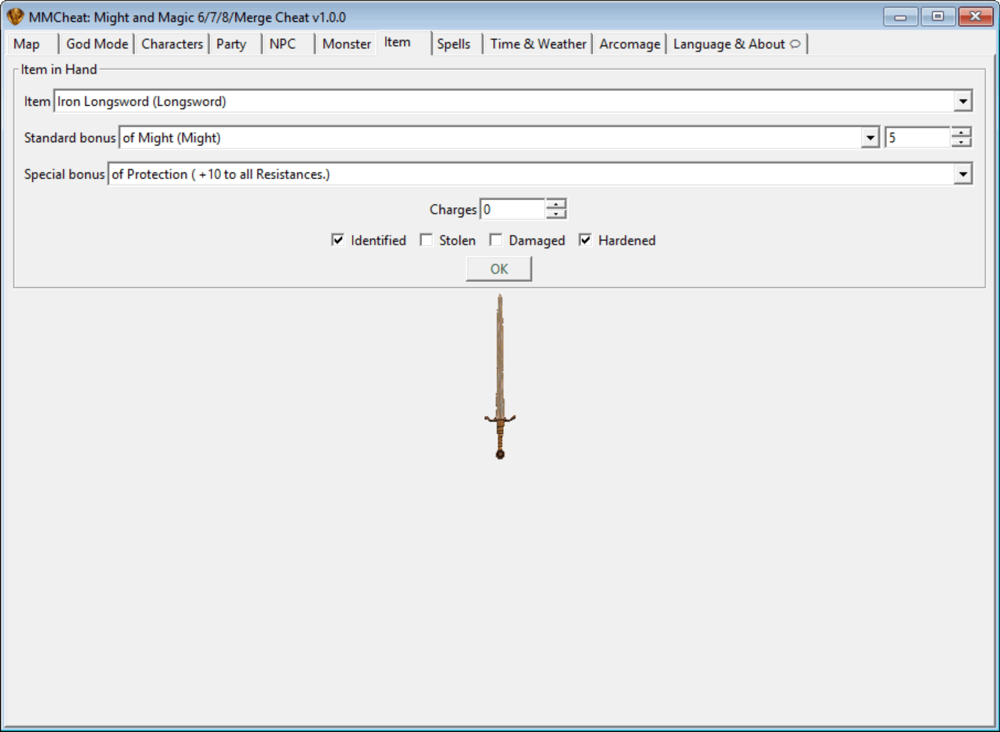

<p align="center">
  
</p>

# MMCheat: Might and Magic 6/7/8/Merge Cheat Suite & Helper Tool

_Keywords: cheat, trainer, tool, helper, cheater, teleporter, map viewer, character, player, stat, editor, god mode, MM6, MM7, MM8, Merge, mod_

**MMCheat** is a cheat and helper tool for _Might and Magic Merge_ (MMMerge) and the GrayFace patched versions of _Might and Magic 6_, _7_, and _8_ (MM6/7/8) role-playing games. It is based on the [GrayFace Patch](https://grayface.github.io/mm/) and [MMExtension](https://grayface.github.io/mm/ext/) (v2.3 is required), both of which are developed by GrayFace.

## Installation

### MM6/7/8

For the standard (CD/GOG/Uplay) versions of _Might and Magic 6_, _7_, or _8_ RPG games, you need to:

1. Download and apply the [GrayFace Patch](https://grayface.github.io/mm/#GrayFace-MM6-Patch) for your game
2. Download [MMExtension 2.3](https://github.com/might-and-magic/mmcheat/releases/download/v1.0.0/MMExtension-2.3-20250115.zip) and extract the "ExeMods" and "Scripts" folders to your game directory (overwrite existing files if any)
3. Download [MMCheat](https://github.com/might-and-magic/mmcheat/releases/download/v1.0.0/MMCheat-1.0.0.zip) and extract the "ExeMods" and "Scripts" folders to your game directory (overwrite existing files if any)

_You must use the link above to download MMExtension 2.3 fetched from its [GitHub repository](https://github.com/GrayFace/MMExtension) instead of its [web page](https://grayface.github.io/mm/ext/) which still has the outdated v2.2 version._

### MMMerge

The [Might and Magic Merge](https://www.celestialheavens.com/forum/topic/16657) is a mod based on the _Might and Magic 8_ GrayFace patch and MMExtension. You must use the **latest MMMerge** version which includes MMExtension 2.3. MMCheat can be used directly with it:

1. Download [MMCheat](https://github.com/might-and-magic/mmcheat/releases/download/v1.0.0/MMCheat-1.0.0.zip) and extract the "ExeMods" and "Scripts" folders to your game directory (overwrite existing files if any)

## Important General Notes

In the game (with map loaded), press <kbd>Ctrl</kbd> + <kbd>Backspace</kbd> to open MMCheat.

**IMPORTANT**: Save the game before using MMCheat, as it could crash.

Button and label colors have different meanings:

- **Red Button** – Applies changes to the game and closes MMCheat.
- **Green Button** – Applies changes to the game without closing MMCheat.
- **Black Button** – Does not apply any changes to the game.
- **Orange Label** – Non-persistent changes removed after game reload or exit.

Right-click on any image to show a context menu to save it as a BMP/SVG file or view image info (file name, width, height).

When a dropdown or list menu is focused (highlighted/opened):

- Press <kbd>Ctrl</kbd> + <kbd>F</kbd> to open a window and quickly search entries
  - You can use <kbd>Up</kbd>, <kbd>Down</kbd>, <kbd>Enter</kbd>, <kbd>Escape</kbd> keys in the window to navigate and select entries
- Press <kbd>Ctrl</kbd> + <kbd>C</kbd> to copy the text of all entries

## Map Tab


### Coordinates

Coordinates to be copied and pasted are formatted like this:

```
X=4790,Y=27279,Z=-2255,Direction=0,LookAngle=0,Name='Hive.Blv'
```

The (map file) Name is case-insensitive.

Coordinates in MM6/7/8 and in MMMerge should be compatible. For example, you can copy New Sorpigal coordinates from MMMerge and paste them into MM6, or vice versa. However, to be perfectly sure to auto-select the correct map when you are using MMMerge and pasting coordinates text that is copied from MM6 or 7, simply add a prefix "6" or "7" at the beginning of the `Name` string. For example, 'out01.odm' would be '7out01.odm', and 'Hive.Blv' would be '6Hive.Blv' (in fact, 'Hive.Blv' doesn't need the prefix, but you can add it anyway; MMCheat will remove unnecessary prefixes).

On an outdoor map:

- The center point is X=0, Y=0
- The South West corner is X=-22528, Y=-22528
- The North East corner is X=22528, Y=22528
- You can fly as high as 3000 in MM6, 4000 in MM7; this limit is different in different maps in MM8 and merge. However, you can teleport higher in the sky than the fly limit.

### Map Image and Circle Controls

Click on the map to select coordinates (X, Y).

Click on the circle controls to select direction and angle.

All images displayed in MMCheat are read directly from the game's memory, except for indoor maps, which are extracted from the `Scripts\Modules\MMCheat\data\indoor2dmap.bin` file.

#### Save Map Image and View Info


Right-click on the map image to save it as a BMP/SVG file or view image information. Outdoor maps are saved as BMP files, while indoor maps can be saved as either SVG or BMP files. The "image info" window displays the file name, width, height, map coordinate (X, Y) range, and map size.

#### Hidden feature: Batch save all maps


To save all maps at once, select any _NWC_ dungeon map (one NWC map exists in each of MM6, 7, and 8, MMMerge has all three NWC maps), right-click and choose save image, then type one of the following as the filename:

- `@allindoorsvg` - Save all indoor maps as SVG files
- `@allindoorbmp` - Save all indoor maps as BMP files
- `@alloutdoorbmp` - Save all outdoor maps as BMP files (outdoor maps don't support SVG format)

MMCheat will save all maps in the selected format to your chosen directory.

**Optional parameters** (all parameters are optional; use `_` to skip a parameter):

```
@allindoorsvg [STROKE_WIDTH] [MAX_NOMINAL_SIZE] [PADDING]
```

- **STROKE_WIDTH**: Thickness of the SVG lines (default: 10)
- **MAX_NOMINAL_SIZE**: Fixed maximum width or height of the SVG output in pixels. If ≤ 0, uses the actual coordinate width and height (default: 1024) (note that it's just a nominal size, SVG is a vector format and can be scaled to any size)
- **PADDING**: Border padding in game coordinate units (default: 100)

```
@allindoorbmp [MAP_IMAGE_SIZE]
```

- **MAP_IMAGE_SIZE**: Width and height in pixels for the square output bitmap (default: 355, which matches the game's outdoor map reachable area size that MMCheat uses to display both outdoor and indoor maps)

```
@alloutdoorbmp [SHOULD_CUT]
```

- **SHOULD_CUT**:
  - `1`, `true`, or leave blank (default): Cut the outdoor map to show only the reachable area
  - `0` or `false`: Use the full original outdoor map image (which is larger than the reachable area)

### Bookmarked Coordinates

You can bookmark coordinates (like Beacons in the game). Click the "Add" button and the set of coordinates in the input fields is saved in /Scripts/Modules/MMCheat/coords.txt and appears in the dropdown. Select one from the dropdown and it will fill up the input fields.

### Lloyd's Beacon

Beacons added by MMCheat won't be visible in the game UI when a character casts the spell, but you can click on where the beacon should be and you'll be teleported to the coordinates.

### Town Portal

A town needs to be "activated" before you can teleport to it in MM7 and 8, so MM6 doesn't need the "Activate all towns" button. The "Set next cast to continental travel" button is MMMerge-only.

### Jump

When you jump too far, it is possible to get stuck in the air. You need to either use "Go to" to teleport to another place, or fly up or down to get out of being stuck.

### Current Map

"Reveal entire map", "Open all doors", "Kill all creatures", and "Force respawn" for the current map are also very useful. The next tab - "God Mode" - does not include these buttons.

## God Mode Tab


Customizable one-click cheats.

The "Thou shalt do them all!" button executes all green buttons on this tab.

These are for all characters in the party, not for all playable characters in MM8 and MMMerge.

### God Mode

Note that, by default, MMMerge's monsters are enhanced according to your characters' level, so you wouldn't want to set your level too high. (So here it defaults to 50 in MMMerge and 500 in native games)

"Set Exp by Base Level" and "Set Base Level by Exp" calculate the equivalent level/experience and fill their input fields.

You could choose "All skills" instead of "Learnable skills", but the character "Skill" panel in the game will have too many skills.

The "Remove all negative Stat Bonuses" button will, of course, remove positive but bad Age Bonuses.

Mistform ability can prevent you from physical attacks, so you need to "Exclude Mistform" to make it work, which is enabled by default.

### Heal

"Lock", which is too powerful to be enabled by default, will make you invulnerable to all damage and bad effects.

"Lock" is also a non-persistent cheat; it will be removed after game reload or exit.

## Character Tab


Remember, as mentioned before, the green button is to apply changes to the game immediately, and the black button is not. So, after making some changes in these sub-tabs of the Character Tab (excluding Active Spells and Item Sub-Tabs), don't forget to click the top-right green "Apply All Changes Below" button before switching to another character or clicking another top-level tab, otherwise your changes will be lost.

### Basics Sub-Tab

#### Basic Info

"Voice ↔ Face" will link the Face number and Voice number. Note that most of the time, for a character, the Face number is equal to the Voice number, but exceptions exist.

In MM6, you can't change the voice number, and if you change the face, the voice will still stay the same.

Bio is MM8 (and MMMerge)-only.

#### Basic Stats

"Level → Exp" and "Exp → Level" buttons will calculate the equivalent level/experience and fill the target input field.

"Current ← Full" buttons will set the current HP/SP to the full value.

Attack recovery time is not in this tab; it is in the "Party" tab.

### Active Spells and Item Sub-Tabs




"Active Spells" and "Item" sub-tabs have green "Apply" buttons by themselves; the top-right green "Apply" button cannot save changes in these two sub-tabs.

The green "Apply" and "Remove" buttons in these sub-tabs take effect immediately.

In the "Item" sub-tab, items with "\*" are equipped items. You can remove or change them like other items, but be careful if you do something like changing an equipped shield to a sword — it is allowed, but the sword will be equipped at the shield slot, which may cause issues.

Select "[Add new item]", change the dropdowns and input fields, and click "Apply" to add a new item. This item adding does not calculate the shape of the item, and the new item could be overlapped with old items in your inventory, but usually it should be OK and wouldn't cause trouble.

### Conditions Sub-Tab



The 3 levels of Poison and Diseased can be considered different conditions sharing the same name.

## Party Tab


Fame is _floor(total_experience / 1000)_ in MM6 and 7, and _floor(main_character_experience / 250)_ in MM8. You need to change characters' experience to change the fame value, so it is not listed in MMCheat.

Attack recovery time change is not persistent; it will be reset after game reload or exit. "Use minimum for melee & shooting" is for all characters (in the party). Shooting minimum recovery time is fixed at 0; only Melee minimum recovery time is changeable.

The "Members" frame is MM8 (including MMMerge)-only. You could use this to change characters' order in the game UI. Duplicated characters in the party are not allowed.

"UI theme" is only for MM7.

## NPC Tab


The NPC system is different in MM6/7 vs MM8 vs MMMerge.

In MM6, fixed NPCs with a number ≥ 254 cannot be hired directly and must be recruited as Street NPCs. It will prompt a choice window: "Would you like to assign this NPC to hired street NPC slot 1 or 2 — overriding any existing NPC — or cancel the hiring?"

## Monster Tab


In "Looting", set the percentage to 0 for infinite looting.

## Item Tab



## Spells Tab


"Cast any spell" is MM8 (and MMMerge)-only for now.

Unlimited daily castings change is not persistent; it will be reset after game reload or exit.

## Time & Weather Tab


Game score is calculated based on the total experience of all characters in the party and the total number of days you finish the game. The score here is the score you would get if you finish the game at the indicated time.

Time exiting the Hive + 10min is used by MM6 (not sure about 7 and 8); this extra time is not calculated here.

The "Snow" checkbox is unchecked by default even if the weather is snow in the game, but it doesn't matter. You can check or leave it unchecked and click "Apply", and it will make it snow or stop snowing.

## Arcomage Tab


MM6 does not have Arcomage.

"Tower to win" and "Resource to win" are only for information; they are non-editable for now.

## Language & About Tab


### MMCheat Language

MMCheat has built-in UI translation for:

English, French, German, Simplified Chinese, Traditional Chinese, Russian, Polish, Spanish, Italian, Czech, Portuguese, Japanese, Korean, Ukrainian

MMCheat supports MM6/7/8/Merge games whose text encoding is:

- Windows-1252 (en, fr, de, es, it, pt)
- Windows-1251 (ru, uk)
- Windows-1250 (pl, cs)
- GB2312 (zh_CN)
- Big5 (zh_TW)
- Shift JIS (ja)
- EUC-KR (ko)

Game text encoding is auto-detected. You could change it manually, but usually you don't need to. If the encoding is set correctly, game text should be properly decoded.

Many text strings are from the game — if you use an English game but set MMCheat language to Chinese, you can see the MMCheat UI is generally in Chinese, but all spell, map, item, monster, NPC, buff, award, skill, class, stat, and resistance names are in English.

The "OK (must restart MMCheat)" button will close the window; you should press <kbd>Ctrl</kbd> + <kbd>Backspace</kbd> to open MMCheat again.

### Configuration File

The configuration file is located at:

- Scripts/Modules/MMCheat/conf.ini

Which is auto-generated when you first run MMCheat.

### Stop Other Processes

When MMCheat is open and you close the game altogether, the game process won't be closed. And if you open a new game, you'll be stuck when you go to another map or save the game.

If you have multiple game processes (mm?.exe) running, you can stop all other processes that are not the currently running one by clicking the "Stop now" button.

"Stop before going to another map with MMCheat" will attempt to kill all other game processes when you click the "Go to" button in the "Map" tab. But this is only for MMCheat; it won't stop other processes when you go to another map or save the game in the game.

## Compatibility

MMCheat should work on all versions of MM6/7/8 and MMMerge. It also supports MM Merge Redone. It hasn't been tested on other mods.

If you want it to work on other mods, you need to add these files:

- Scripts\Modules\MMCheat\data\<MOD_NAME>\_indoor2dmap.bin
- Scripts\Modules\MMCheat\data\<MOD_NAME>\_defaultcoords.lua

## Copyright

See [CREDIT.md](CREDIT.md)
